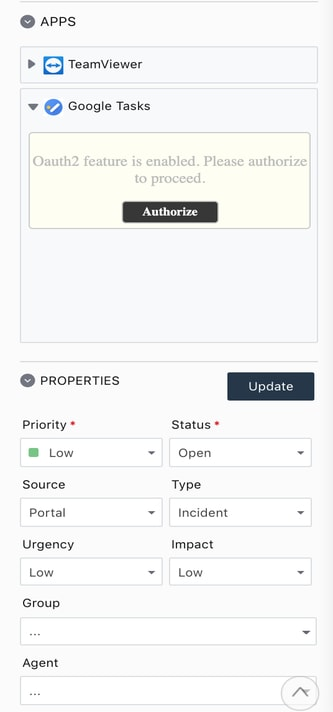
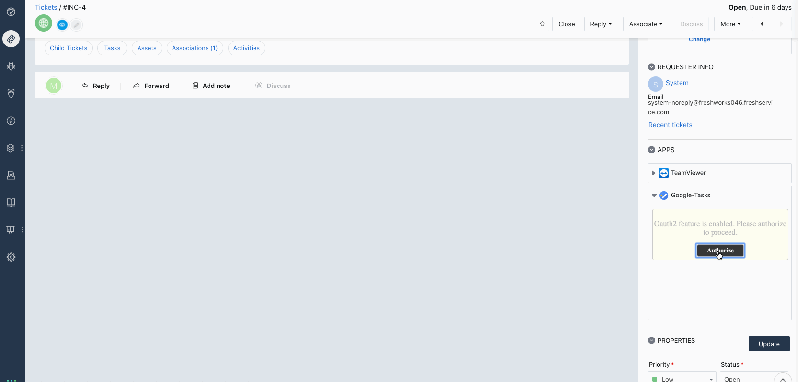

## Google Tasks

This app let `freshservice` agents login to their Google account and then let them create, read, delete tasks andc  tasklists. 

### Pre-requisities
- [fdk](https://developers.freshservice.com/docs/quick-start/#install_the_sdk) - Freshworks Developer Kit

### How to run the app?
Clone this app with git client. Add the `client_id`, `client_key`, `key` of your google app in the `config/sample_oauth_config.json` and rename it to `config/oauth_config.json`. Start the app using the command,
```
fdk run
```

### Testing the app
Then login to your domain `https://domain.freshservice.com/helpdesk/tickets/1?dev=true`. Test your app as mentioned [here](https://developers.freshservice.com/docs/quick-start/#test_your_app).

### Screenshots



### Technologies
- Javascript
- HTML
- css
- Google Tasks api (of-course)