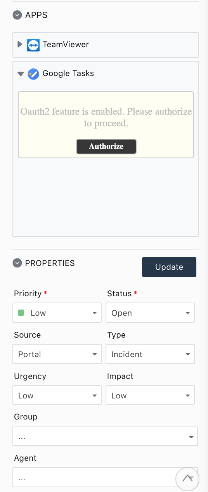

## Google Tasks

This app let `freshservice` agents login to their Google account and then let them create, read, delete tasks andc  tasklists. 

### How to run the app?

#### Pre-requisities
- [fdk](https://developers.freshservice.com/docs/quick-start/#install_the_sdk) - Freshworks Developer Kit

Clone this app with git client. Add the `client_id`, `client_key`, `api_key` of your google app in the `config/oauth_config.json` and then run,
```
fdk run
```
Then login to your domain `https://domain.freshservice.com/helpdesk/tickets/1?dev=true`. Test your app as mentioned [here](https://developers.freshservice.com/docs/quick-start/#test_your_app).

### Screenshots

